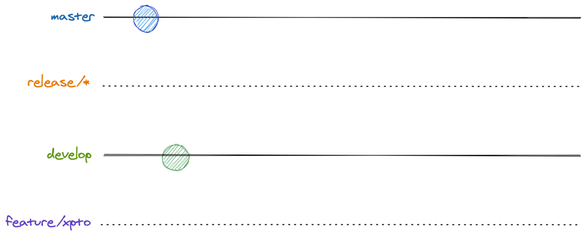

# Introduction

Project is written with `vite 4` and `vue3` in mind.

### Main features
#### Project
* Separated dev and production settings
* Include some pages: Home, Login
* Support page layout 
* Support PWA
* Support I18n
* Support auto import component and hook

### Directory Structure

```
├── .husky
│   ├── _
│   ├── pre-commit
├── .vscode
│   ├── extensions.json
├── public
│   ├── _headers
│   ├── vite.svg
├── src
│   ├── assets
│   ├── components
│   ├── helpers
│   │   ├── constants.vue
│   ├── layouts
│   │   ├── 404.vue
│   │   ├── default.vue
│   │   ├── home.vue
│   ├── locales
│   │   ├── en.yml
│   │   ├── ja.yml
│   ├── pages
│   │   ├── index.vue
│   │   ├── login
│   │   │   ├── index.vue
│   ├── plugins
│   │   ├── i18n.ts
│   │   ├── validators.ts
│   ├── routers
│   │   ├── router.ts
│   ├── stores
│   │   ├── auth.ts
│   ├── App.vue
│   ├── auto-imports.d.ts
│   ├── components.d.ts
│   ├── main.ts
│   ├── style.css
│   ├── vite-env.d.ts
├── .browserslistrc
├── .editorconfig
├── .env.example
├── .eslintignore
├── .eslintrc
├── .eslintrc-auto-import.json
├── .gitignore
├── index.html
├── LICENSE
├── package.json
├── package-lock.json
├── postcss.config.js
├── README.md
├── tailwind.config.js
├── tsconfig.json
├── tsconfig.node.json
└── vite.config.ts
```

### Application Router

| path     | description  |
|----------|--------------|
| /        | Home Page    |
| /login   | Login Page   |
| /contact | Contact Page |
| /[all]   | 404 Page     |


# Gitflow
## Main Flow

The main flow is easy to follow and the one we should strive to achieve. But, first things first, you should pair your local `develop` branch with what is on remote.

```bash
$ git checkout develop

$ git pull
```

Then, it's time to create your feature/issue branch:

```bash
$ git checkout -b feature/xxx 

or

$ git checkout -b issue/123
```

If your local development workspace doesn't have the `feature/xxx` or `issue/123` branch, the command above will create it and switch your workspace to the newly created branch!

Now, it's time to code! After you made your changes and think you have enough code to constitute a commit (a package with changes), create it with:

```bash
$ git add changed-file # if you want to add all changes made to all files into one commit: git add .

$ git commit -m "nice commit message" 
```

Then, when you feel confortable, just push your changes to remote!

```bash
$ git push -u origin feature/xpto

or 

$ git push -u origin issue/123
```

This will push any commit you did on your feature branch to remote and set the remote branch as a source reference to your local branch, so that any `git pull` and `git push` you do later, when working in this branch, is done referencing the remote one.

Many `git add`, `git commit` and `git push` later, it's time to bring your new feature to the remote `develop` branch and update the development environment with your changes. But, before that, we want to evaluate what you did, checking if the changes address what the task asked, if there are enough tests, if the code can introduce any obscure bug, etc. And, for this, we run through a process called **Code Review**. It's an important step to prevent any undesirable change and to leverage the knowledge across the team.

# Usage
## Getting Started

First clone the repository from GitHub and switch to the new directory:
```shell
$ git clone git@github.com:Outcome-Inc/pj_234_fe.git

$ cd pj_234_fe
```
Create .env file and insert .env to .env (view .env.example)
Install project dependencies and run dev server:
```shell
$ npm install

$ npm run dev
```

Build production mode and run preview server:
```shell
$ npm run build

$ npm run preview
```
